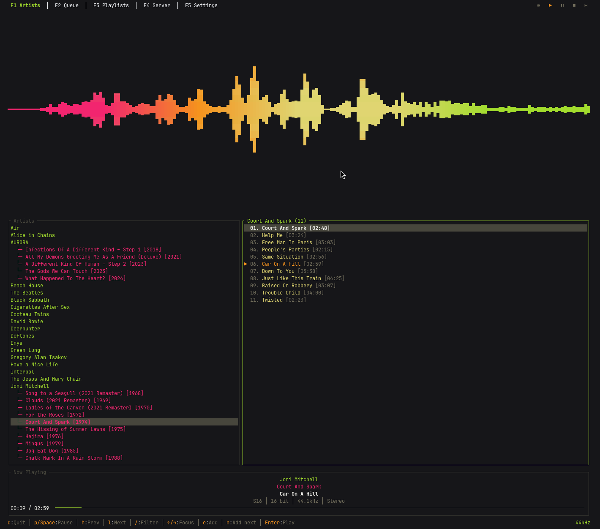

# Ferrosonic

A terminal-based Subsonic music client written in Rust, featuring bit-perfect audio playback, gapless transitions, and full desktop integration.

Ferrosonic is inspired by [Termsonic](https://git.sixfoisneuf.fr/termsonic/about/), the original terminal Subsonic client written in Go by [SixFoisNeuf](https://www.sixfoisneuf.fr/posts/termsonic-a-terminal-client-for-subsonic/). Ferrosonic is a ground-up rewrite in Rust with additional features including PipeWire sample rate switching for bit-perfect audio, MPRIS2 media controls, multiple color themes, and mouse support.

## Features

- **Bit-perfect audio** - Automatic PipeWire sample rate switching to match the source material (44.1kHz, 48kHz, 96kHz, 192kHz, etc.)
- **Gapless playback** - Seamless transitions between tracks with pre-buffered next track
- **Persistent playback (optional)** - A background daemon owns the audio session so music keeps playing when you close the terminal. It is the same `ferrosonic` binary re-launched in the background, auto-spawned by the TUI; toggle off in Settings for single-process mode.
- **MPRIS2 integration** - Full desktop media control support (play, pause, stop, next, previous, seek) with push-style `PropertiesChanged` notifications
- **Desktop notifications** - Track-change notifications with cover art via the freedesktop.org `org.freedesktop.Notifications` interface (works under mako, dunst, GNOME, KDE); fired daemon-side so they appear even with the TUI closed
- **Scrobbling** - Reports plays to the server (Last.fm / ListenBrainz when linked server-side) via classic `scrobble` plus the OpenSubsonic `reportPlayback` extension when the server advertises it
- **Library page** - Tree-based artist/album browser with expandable artists and album listings
- **Quick Play page** - Jump straight into your **Starred** songs or a **Random** roll without browsing
- **Star songs** - Mark favourites with `n` (currently-playing) or `m` (highlighted); starred tracks show a ★ everywhere and populate the Quick Play Starred view
- **Shuffle play** - Shuffle all songs by a selected artist or album directly from the Library page
- **Repeat modes** - Cycle Off / One / All with `r`; the gapless pre-loader re-preloads the same track on One and wraps on All
- **Cover art** - Display album art in the now-playing section using kitty / iTerm2 / sixel image protocols; falls back to half-blocks on plainer terminals (chafa-enhanced when the `chafa` library is installed)
- **Playlist support** - Browse and play server playlists with shuffle capability
- **Play queue management** - Add, remove, reorder, shuffle, and clear queue history; queue persists across daemon restarts
- **Save queue as playlist** - Press `s` on the Queue page to create a server-side playlist from the current queue
- **Audio quality display** - Real-time display of sample rate, bit depth, codec format, and channel layout
- **Audio visualizer** - Integrated cava audio visualizer with theme-matched gradient colors
- **13 built-in themes** - Default, Monokai, Dracula, Nord, Gruvbox, Catppuccin, Solarized, Tokyo Night, Rosé Pine, Everforest, Kanagawa, One Dark, and Ayu Dark
- **Custom themes** - Create your own themes as TOML files in `~/.config/ferrosonic/themes/`
- **Mouse support** - Clickable buttons, tabs, lists, and progress bar seeking
- **Library search** - `/` runs a single unified server-side `search3` across artists, albums, and songs at once, results shown together in the tree
- **Multi-disc album support** - Proper disc and track number display
- **Keyboard-driven** - Vim-style navigation (j/k) alongside arrow keys

## Screenshots



## Installation

### Dependencies

Ferrosonic requires the following at runtime:

| Dependency | Purpose | Required |
|---|---|---|
| **mpv** | Audio playback engine (via JSON IPC) | Yes |
| **PipeWire** | Automatic sample rate switching for bit-perfect audio | Recommended |
| **WirePlumber** | PipeWire session manager | Recommended |
| **D-Bus** | MPRIS2 desktop media controls | Recommended |
| **cava** | Audio visualizer | Optional |
| **chafa** | Higher-fidelity cover-art half-blocks (sextants / braille / dithering). Loaded via `dlopen` at runtime; if absent, ferrosonic falls back to primitive `▀▄` half-blocks. | Optional |

### Quick Install

Supports Arch, Fedora, and Debian/Ubuntu. Installs runtime dependencies, downloads the latest precompiled binary, and installs to `/usr/local/bin/`:

```bash
curl -sSf https://raw.githubusercontent.com/jaidaken/ferrosonic/master/install.sh | sh
```

The install drops a single `ferrosonic` binary into `/usr/local/bin/`. It runs as the TUI by default and re-launches itself in the background as the daemon when persistent playback is enabled.

### Build from Source

If you prefer to build from source, you'll also need: Rust toolchain, pkg-config, OpenSSL dev headers, and D-Bus dev headers. Then:

```bash
git clone https://github.com/jaidaken/ferrosonic.git
cd ferrosonic
cargo build --release
sudo cp target/release/ferrosonic /usr/local/bin/
```

## Usage

```bash
# Run with default config (~/.config/ferrosonic/config.toml)
ferrosonic

# Run with a custom config file
ferrosonic -c /path/to/config.toml

# Enable verbose/debug logging
ferrosonic -v

# Force single-process mode (skip the daemon connect/auto-spawn)
ferrosonic --standalone
```

### Persistent playback

By default, `ferrosonic` connects to a background daemon and auto-spawns one (the same binary re-exec'd with the internal `--daemon` flag) if it isn't running. Music then keeps playing when you close the terminal. Reopen `ferrosonic` and you'll see the same queue at the same position.

Turn it off in Settings (`F6 → Daemon: Off`) for a single-process mode where music stops when the TUI exits. Or use `--standalone` for a one-off launch without changing the config.

For users who want the daemon at login time, a systemd user unit is shipped under [`contrib/ferrosonicd.service`](contrib/ferrosonicd.service):

```bash
mkdir -p ~/.config/systemd/user
cp contrib/ferrosonicd.service ~/.config/systemd/user/
systemctl --user enable --now ferrosonicd.service
```

## Configuration

Configuration is stored at `~/.config/ferrosonic/config.toml`. You can edit it manually or configure the server connection through the application's Server page (F5).

```toml
BaseURL = "https://your-subsonic-server.com"
Username = "your-username"
Password = "your-password"
Theme = "Default"
Daemon = true
Cava = false
CavaSize = 40
AutoContinue = false
RepeatMode = "Off"
CoverArt = false
CoverArtSize = 16
Scrobble = true
Notifications = true
```

| Field | Description |
|---|---|
| `BaseURL` | URL of your Subsonic-compatible server (Navidrome, Airsonic, Gonic, etc.) |
| `Username` | Your server username |
| `Password` | Your server password |
| `PasswordFile` | Optional path to a file containing the password (overrides `Password`) |
| `Theme` | Color theme name (e.g. `Default`, `Catppuccin`, `Tokyo Night`) |
| `Daemon` | `true` (default) auto-spawns the background daemon; `false` runs single-process |
| `Cava` | Enable the cava visualizer pane |
| `CavaSize` | Cava pane height percentage (10-80, step 5) |
| `AutoContinue` | Fetch fresh random songs and keep playing when the queue ends |
| `RepeatMode` | Queue repeat: `"Off"`, `"One"`, or `"All"` |
| `CoverArt` | Show cover art in the now-playing section (kitty / iTerm2 / sixel terminals) |
| `CoverArtSize` | Cover art pane width in columns (default 16) |
| `Scrobble` | Report plays to the server, default `true` (classic `scrobble` + OpenSubsonic `reportPlayback`) |
| `Notifications` | Desktop track-change notifications with cover art, default `true` |

Logs are written to `~/.config/ferrosonic/ferrosonic.log` (TUI) and `~/.config/ferrosonic/ferrosonicd.log` (daemon). The queue is persisted to `~/.config/ferrosonic/queue.json` so it survives daemon restarts.

## Keyboard Shortcuts

### Global

| Key | Action |
|---|---|
| `q` | Quit |
| `p` / `Space` | Toggle play/pause |
| `l` | Next track |
| `h` | Previous track |
| `n` | Star/unstar currently-playing song |
| `r` | Cycle repeat mode (Off → One → All) |
| `Shift+T` | Shuffle the entire library and play |
| `Ctrl+R` | Refresh data from server |
| `F1` | Library page |
| `F2` | Queue page |
| `F3` | Quick Play page |
| `F4` | Playlists page |
| `F5` | Server configuration page |
| `F6` | Settings page |

### Library Page (F1)

| Key | Action |
|---|---|
| `/` | Unified search: typing fires one server-side `search3` across artists, albums, and songs |
| `Enter` | Lock the filter in (keeps results, exits input mode) |
| `Esc` | Clear filter and search results |
| `Up` / `k` | Move selection up |
| `Down` / `j` | Move selection down |
| `Left` / `Right` | Switch focus between tree and song list |
| `Enter` | Expand/collapse artist, or play album/song |
| `Backspace` | Return to tree from song list |
| `e` | Add selected item to end of queue |
| `i` | Add selected item as next in queue |
| `t` | Shuffle play all songs by the selected artist or album |
| `m` | Star/unstar highlighted song (songs pane focus only) |

### Queue Page (F2)

| Key | Action |
|---|---|
| `Up` / `k` | Move selection up |
| `Down` / `j` | Move selection down |
| `Enter` | Play selected song |
| `d` | Remove selected song from queue (advances to next if removing current) |
| `J` (Shift+J) | Move selected song down |
| `K` (Shift+K) | Move selected song up |
| `t` | Shuffle queue (current song stays in place) |
| `c` | Clear played history (remove songs before current) |
| `s` | Save the current queue as a server-side playlist |
| `m` | Star/unstar highlighted song |

### Quick Play Page (F3)

| Key | Action |
|---|---|
| `Tab` | Switch focus between song options and song list |
| `Left` / `Right` | Switch focus between options pane and song list |
| `Up` / `k` | Move selection up (navigate options or songs) |
| `Down` / `j` | Move selection down (navigate options or songs) |
| `Enter` | Play selected song (queues all visible songs and starts from selection) |
| `m` | Star/unstar highlighted song |

The Quick Play page has two modes selectable from the options pane: **Starred** (shows your starred/favourited songs from the server) and **Random** (a fresh 500-song roll from the library on each visit).

### Playlists Page (F4)

| Key | Action |
|---|---|
| `Tab` / `Left` / `Right` | Switch focus between playlists and songs |
| `Up` / `k` | Move selection up |
| `Down` / `j` | Move selection down |
| `Enter` | Load playlist songs or play selected song |
| `e` | Add selected item to end of queue |
| `i` | Add selected song as next in queue |
| `t` | Shuffle play all songs in selected playlist |
| `m` | Star/unstar highlighted song (songs pane focus only) |

### Server Page (F5)

| Key | Action |
|---|---|
| `Tab` | Move between fields |
| `Enter` | Test connection or Save configuration |
| `Backspace` | Delete character in text field |

F-keys still switch pages from the Server page; any unsaved edits are discarded on the way out.

### Settings Page (F6)

| Key | Action |
|---|---|
| `Up` / `Down` | Move between settings |
| `Left` | Previous option |
| `Right` / `Enter` | Next option |

Settings include theme selection, cava visualizer toggle + size, cover art toggle + size, repeat mode, auto-continue, scrobbling, desktop notifications, and the daemon-mode preference. Changes are saved automatically. The daemon-mode toggle takes effect on the next launch.

## Mouse Support

- Click page tabs in the header to switch pages
- Click playback control buttons (Previous, Play, Pause, Stop, Next) in the header
- Click items in lists to select them
- Click the progress bar in the Now Playing widget to seek

## Audio Features

### Bit-Perfect Playback

Ferrosonic uses PipeWire's `pw-metadata` to automatically switch the system sample rate to match the source material. When a track at 96kHz starts playing, PipeWire is instructed to output at 96kHz, avoiding unnecessary resampling. The original sample rate is restored when the application exits.

### Gapless Playback

The next track in the queue is pre-loaded into MPV's internal playlist before the current track finishes, allowing seamless transitions with no gap or click between songs.

### Now Playing Display

The Now Playing widget shows:
- Artist, album, and track title
- Audio quality: format/codec, bit depth, sample rate, and channel layout
- Visual progress bar with elapsed/total time

## Themes
Ferrosonic ships multiple built-in themes, as well as support for custom themes. Here are two examples:
<!-- A file in docs/ should be added with every built-in theme to show them off fully, these are just examples -->

| Nord | Gruvbox |
|---|---|
|  |  |

To know more about themes, **visit the [themes documentation](docs/themes.md)**.

## Compatible Servers

Ferrosonic works with any server implementing the Subsonic API, including:

- [Navidrome](https://www.navidrome.org/)
- [Airsonic](https://airsonic.github.io/)
- [Airsonic-Advanced](https://github.com/airsonic-advanced/airsonic-advanced)
- [Gonic](https://github.com/sentriz/gonic)
- [Supysonic](https://github.com/spl0k/supysonic)

## Testing

The full test suite uses `cargo-nextest` for parallel execution and
`wiremock` / a fake-mpv harness for integration tests against the daemon,
audio stack, and Subsonic client without spawning real services. One
optional smoke test runs against real `mpv` to catch protocol drift.

```bash
# Run everything (fast).
cargo nextest run --all-targets

# Or vanilla cargo if you don't have nextest installed.
cargo test --all-targets

# Coverage report (HTML + summary).
cargo install cargo-llvm-cov
cargo llvm-cov --all-features --workspace --html
```

CI runs fmt, clippy, the full test suite (with real `mpv` installed),
and a coverage report on every push and pull request. Coverage is
reported as a warning, not a hard gate.

## Acknowledgements

Ferrosonic is inspired by [Termsonic](https://git.sixfoisneuf.fr/termsonic/about/) by SixFoisNeuf, a terminal Subsonic client written in Go. Ferrosonic builds on that concept with a Rust implementation, bit-perfect audio via PipeWire, and additional features.
